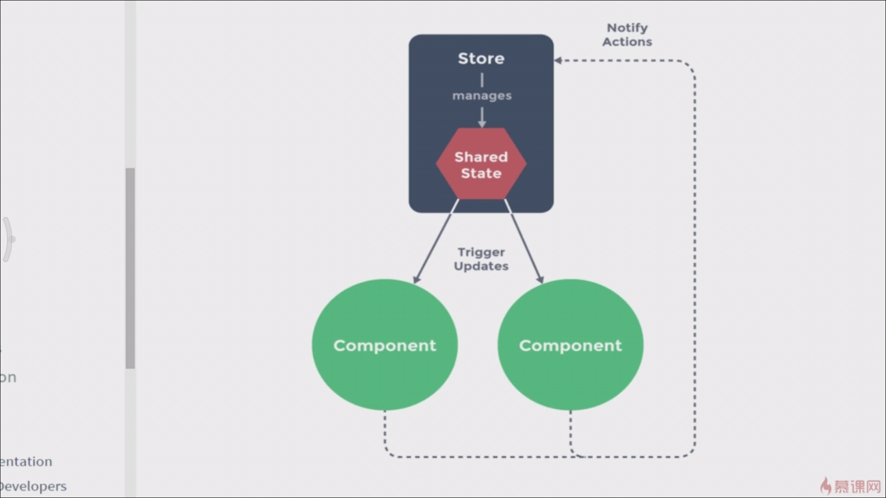

## vuex 状态管理

> 什么是vuex

* vuex 是一个专为Vue.js 应用程序开发的状态管理模式，它采用了
  
  集中式存储管理应用的所有组件的状态。
  
* 我们的整站有很多数据，很多状态，有很多的组件组成的，组件之间

  也会共享状态，例如：用户的分路径状态，或者是购物车，因为在很多的地方用到了
  
  那我在其中一个地方改变了数据，页面也要进行一个同步的更新
  
  
  
> 状态管理模式

  1. 统一的数据中心store 用来维护所有的状态数据，每一个
  
  组件更新的时候，就会通知数据中心，数据中会将这样的一个共享的状态
  
  触发每一个掉用它组件的更新
  
  
  

>  Flux状态模型

 *  vue引入了flux概念 并进行了一下简化
 *  流程：实现数据共享的作用
 
    1.  vue组件通过actions动作来操作mutations
    2.  mutations 控制数据中心的一个状态
    3.  状态更改以后在渲染到组件页面更改
    
    绿色边框所标注的地方都是vuex所做的事情
    
    * actions 是异步的可调用后台api
    * mutations 同步更改state数据
    * vue组件是通过dispatch 触发actions的
    * actions通过commit来触发mutations
    

