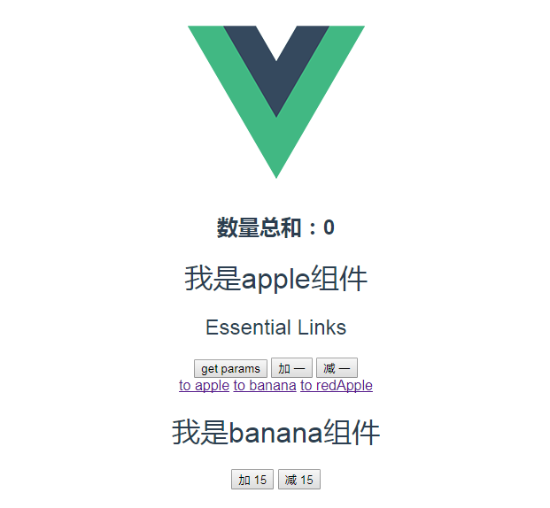

##  vuex类似于购物车效果


> 实现效果
 
  * 页面中有两个组件 apple 、banana 组件
  
  * 通过点击加减数量来添加删除数量
  
  * 数量总和用于显示计算完的结果





> 代码实现


1. app.vue

```
<template>
   <div id='app'>
     
     <h2>数据结构: {{totalPrice}}<h2>
      <Apple></Apple>
      <Banana></Banana>
   </div> 

</template>

<script>
import Apple from './components/apple'
import Banana from './components/Banana'
   export default{
     name:'app',
     components:{
      Apple,
      Banana
     },
     computed:{
        totalPrice(){
        reurn this.$store.state.totalPrice
        }
    }
   }
</script>
<style></style>
```

2. apple.vue

```
  <template>
     <h1>I am appleComponent</h1>
     <button @click="addOne">加 一</button>
     <button @click="minusOne">减 一</button>
  </template>

<script>
   export default{
     dadta(){
      return{
        price:5
       }
     },
     methods:{
       addOne(){
       this.$store.commit('increment',this.price)
        },
       minusOne(){
       this.$store.commit('decrement',this.price)
       }
     }
   }

</script>

<style></style>


```

3. banana.vue

```

<template>
   <h1>I am BananaComponent</h1>
  <button @click="">加 15</button>
  <button @click="">减 15</button>
</template>

<script>
   export default{
      data(){
        price:15
      },
      methods:{
        addFifteen(){
        this.$store.commit('increment',this.preice)
      },
        minusFifteen(){
          this.$store.commit('decrment',this.price) 
        }
      }
   }
</script>
<style></style>

```

4. main.js

```
import Vue from 'vue'
import VRouter from 'vue-router'
import Vuex from 'vuex'
import App from 'app'

Vue.use(VRouter)
Vue.use(Vuex)


let store=Vuex.Store({
    state:{
      totalPrice:0
    },
    mutations:{
       increment(state,price){
         state.totalPrice+=price
        },
        decrement(state,price){
          state.totalPrice-=price
        }
    }
})

let router=new VRouter({
     mode:'history',
     routes:[
       {
         path:'/apple',
         component:组件名称
       }
     ]
})


new Vue({
 el:'#app',
 router,
 store,
 components:'<App/>',
 template:{App}
})


```


