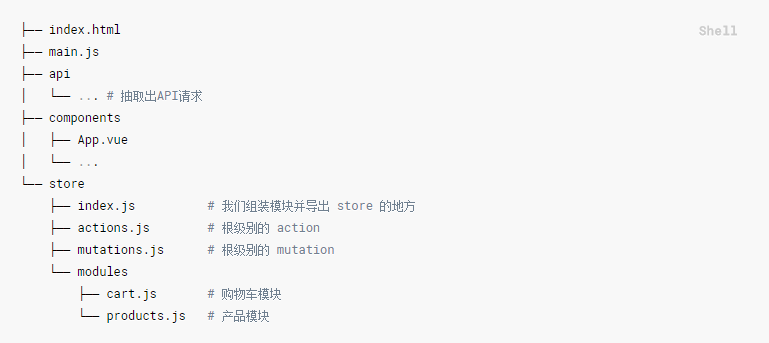

## vuex 在项目中是如何应用的

vuex 并不限制你的代码结构，但是它规定了一些要遵守的规则

> 三个原则

1. 应用层级的状态应该集中到单个store对象中

2. 提交mutations是更改状态的唯一方法，并且这个过程是同步的

3. 异步逻辑都应封装到action里面

只要遵循以上规则，如果你的store文件太大，只需要将actio、mutation、和getters分割到单独的文件。

对于大型应用，我们会希望把Vuex相关代码分割到模块中，

购物车实例：

https://github.com/vuejs/vuex/tree/dev/examples/shopping-cart

