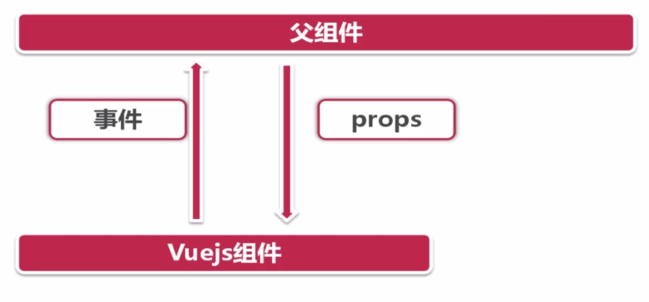
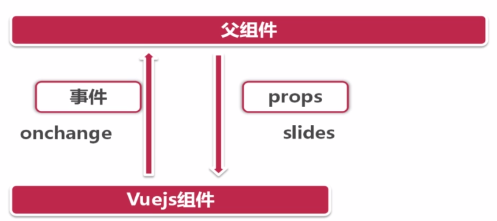

## 组件之间的交互


1. 在vue里面，父组件向子组件传递信息通过子组件的props属性
 
2. 子组件想要通知父组件通过自定义事件来实现




> 那么幻灯片这样的个子组件需要属性和事件呢？
  1. 在事件上，我们可以设置有一个onchange事件，每一次幻灯片切换了，我都通知父组件。
  2. 父组件需要告诉我们要展示的一个图片的数组，以及相应的一些信息的数组。
 
> 在做组件时，我们这个组件跟他调用的这个父组件之间有怎样的一些交互关系。
  



> index.vue
 
 >js中引用文件必须使用require，在webpack中。
  * index.vue给子组件传的数据slide数组中src图片必须使用require()，require会通过webpack来解析具体的位置
  * css和模板中的src都会被webpack自动解析，直接书写即可，只有在js中的src需要使用ruqire()
  

```vue
<template>
   <div>
      <slide-show :slides="slides"></slide-show>
      // 因为silde-show 在不同的地方或者组件会被多次调用，所以我们不能给slide写死值，我们通过
      // 绑定属性来想slideShow组件传数据
   </div>
</template>
<script >
   export default{
       data(){
           return{
               slides:[
                   {
                      src:require('../assests/slideShow/pic1.jpg'),
                      title:xxx1,
                      href:'detail/analysis'
                   },
                    {
                      src:require('../assests/slideShow/pic2.jpg'),
                      title:xxx1,
                       href:'detail/analysis'
                    }
               ]
           }
       }
   }
</script>
<style>

</style>

```

> slideShow.vue
* 父组件箱子组件传递数据，子组件需要来接收父组件 :slides='slides' 过来的数据
* 在vue里面子组件是不能直接通过this.slide来直接获取父组件传递过来的数据的
* 子组件想要获取父组件传递过来的数据，必须声明一下，通过props来接收数据。
* props里面也可以设置它类型和默认值,可以非常严谨的设置数据类型 例如：
   
``` js
  export default {
     prorps:{
        type:Array,
        default:[]
     }
  }
   
```


```vue
<template>
  <div>
      i am is slideShow   
  </div>
</template>
<script >
   export default {
       props:{
           slides:{}
       },
       data(){
           return{x:1}
       },
       mounted(){
           console.log(slides)
          
       }
   }
</script>
<style>

</style>


```

> slideShow.vue 向父级传递信息，通过$emit() 事件通知方式,有了$emit()以后我们就可以在父组件通过@方式了监听事件
````vue

export default{
   data(){
   
   },
   methods:{
      goto(){
         this.$emit('onchange',index)
      }
   }
}


````


> index.vue 使用@方式来监听事件

```vue
<template>
 <div>
 
   <slide-show  :slides="slides" :inv="invTime" @onchange="slideShowOnchange"></slide-show>
 
</div>

</template>


export default {
  data(){
  inv:2000
  slides:[
     {....}
    ]
  },
  methods:{
     slideShowOnchange:function(index){
     
         console.log(index)     
     }
  }


}


```


